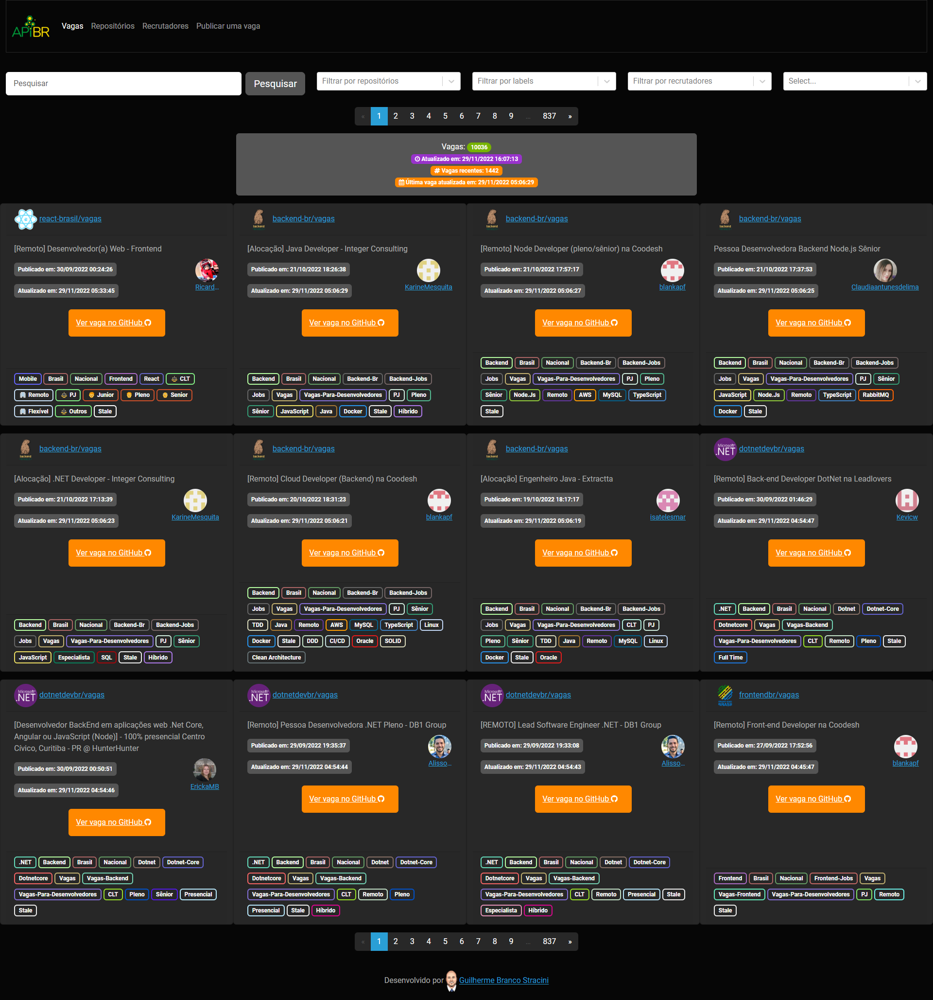

# Vagas Aggregator UI

📝🏢 Aggregates open vacancies for developers based on more than 50 GitHub accounts for opportunities and some other sites.

- UI: [https://apibr.com/ui/vagas/](https://apibr.com/ui/vagas/)
- API (V2): [https://apibr.com/vagas/api/v2](https://apibr.com/vagas/api/v2)
- Swagger: [https://apibr.com/vagas/swagger](https://apibr.com/vagas/swagger)

## Code Quality

 

